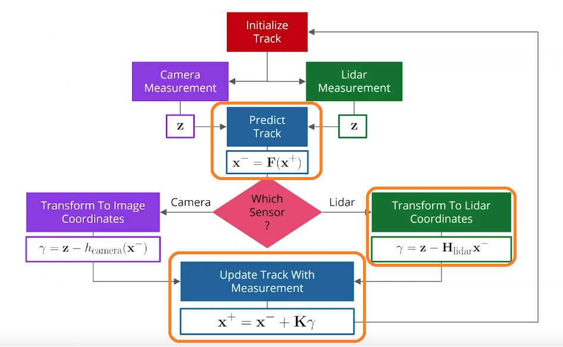
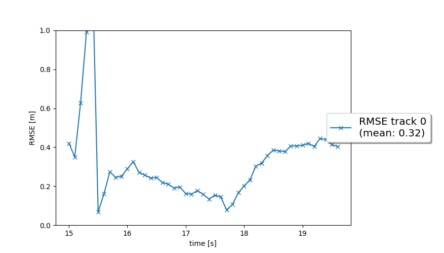
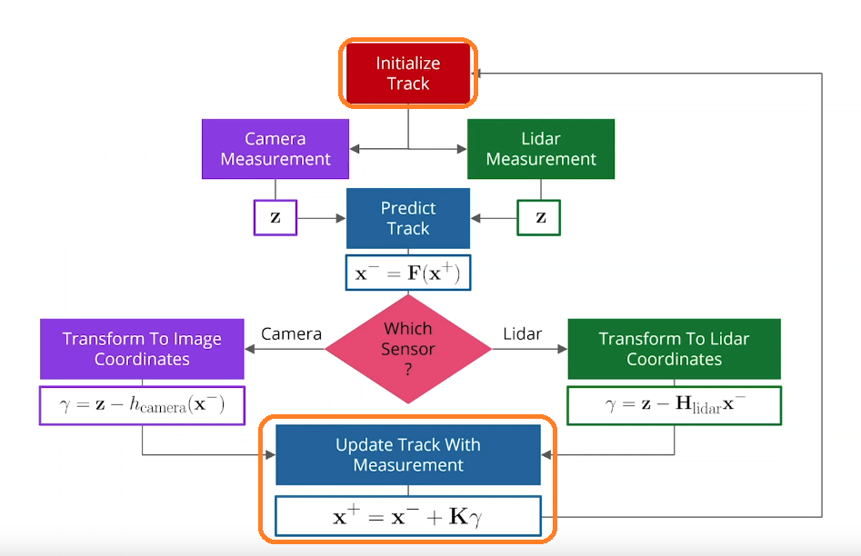
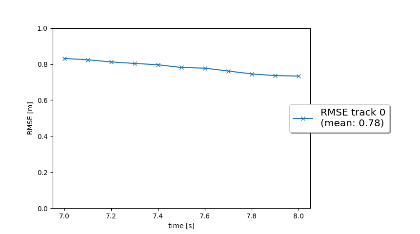
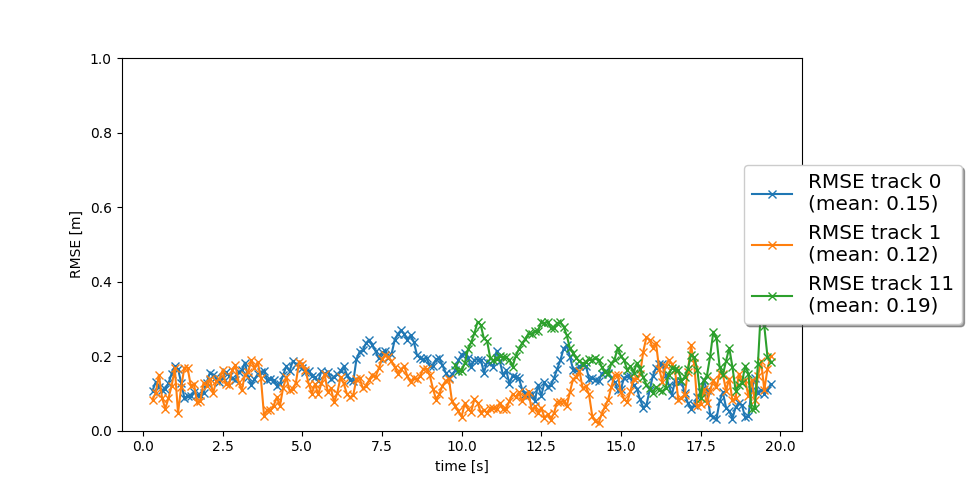
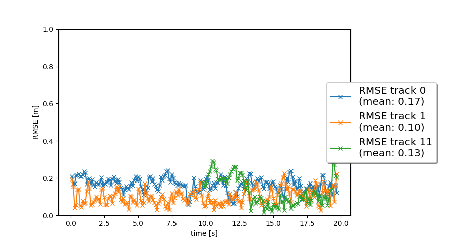

# Writeup: Track 3D-Objects Over Time
## STEP1: EKF to track a single real-world target with lidar measurement input over time


The problem is in 3 parts in sensor fusion in EKF (orange).

### Implement the predict() function

```python
def predict(self, track):
    # Get current state
    x = track.x
    P = track.P

    # Build F and Q
    F = self.F() # State transition matrix
    Q = self.Q() # Process noise covariance matrix

    # Predict state x and estimation error covariance P
    x = F @ x 
    P = F @ P @ F.T + Q

    # Save x and P in track
    track.set_x(x)
    track.set_P(P)
```

#### Implement F() and Q() Functions
```python
def F(self):
    return np.matrix([[1, 0, 0, dt,  0,  0],
                      [0, 1, 0,  0, dt,  0],
                      [0, 0, 1,  0,  0, dt],
                      [0, 0, 0,  1,  0,  0],
                      [0, 0, 0,  0,  1,  0],
                      [0, 0, 0,  0,  0,  1]])

def Q(self):
    # Process noise intensity parameter  q = params.q  
    # Time interval between predictions dt = params.dt 

    # Calculate elements of the Q matrix using dt
    q3 = (q / 3) * dt**3  # Position noise (third order)
    q2 = (q / 2) * dt**2  # Mixed position-velocity noise (second order)
    q1 = q * dt           # Velocity noise (first order)

    # Process noise covariance matrix Q
    return np.matrix([[q3, 0,  0,  q2, 0,  0],      # Noise in x and vx
                      [0,  q3, 0,  0,  q2, 0],      # Noise in y and vy
                      [0,  0,  q3, 0,  0,  q2],     # Noise in z and vz
                      [q2, 0,  0,  q1, 0,  0],      # Mixed noise x-vx
                      [0,  q2, 0,  0,  q1, 0],      # Mixed noise y-vy
                      [0,  0,  q2, 0,  0,  q1]])    # Mixed noise z-vz

```

Load preset parameters: dt, q, dim_state
```python
#From misc/params.py, load the following parameters: dt, q, dim_state.
from misc.params import dt, q, dim_state
```

### Implement the update() function

```python
def update(self, track, meas):
    # Get the measurement matrix H and residual (gamma)
    H = meas.sensor.get_H(track.x)
    gamma_val = self.gamma(meas, track)
    S_val = self.S(meas, track)

    # Calucalte Kalman gain
    K = track.P @ H.T @ np.linalg.inv(S_val)

    # Update state estimate and cocariance P
    x = track.x + K @ gamma_val
    I = np.identity(dim_state) # Create an identity matrix with size dim_state
    P = (I - K @ H) @ track.P

    # Save state x and covariance P 
    track.set_x(x)
    track.set_P(P)

    track.update_attributes(meas)
```

#### Implement gamma() and S() Functions
```python
def gamma(self, track, meas):
    # Compute the residual: gamma = z - H 
    hx = meas.sensor.get_hx(track.x)
    gamma = meas.z - hx
    return gamma

def S(self, track, meas, H):
    # Calculate covariance of residual: S = H * P * H.T + R
    H = meas.sensor.get_H(track.x)
    S = H @ track.P @ H.T + meas.R
    return S
```

### Result:




## STEP2: Implement the track management


The problem is in 2 parts in sensor fusion in EKF (orange).
### Implement Initialize Track

```python
class Track:
    INITIALIZED = 'initialized'
    TENTATIVE = 'tentative'
    CONFIRMED = 'confirmed'
    def __init__(self, meas, id):
        print('creating track no.', id)
        M_rot = meas.sensor.sens_to_veh[0:3, 0:3] # rotation matrix from sensor to vehicle coordinates
       
        # Transform measurement coordinates from sensor frame to vehicle frame
        pos_vehicle = M_rot @ meas.z

        # Initialize the state vector x (position + velocity)
        self.x = np.zeros((params.dim_state, 1))  # Vector trạng thái (position + velocity)
        self.x[:3] = pos_vehicle   # Set the measured position in the state vector

        # Initialize the state covariance matrix P with appropriate uncertainties
        self.P = np.eye(params.dim_state)
        self.P[3, 3] = params.sigma_p44 ** 2    # Variance for velocity in x-direction
        self.P[4, 4] = params.sigma_p55 ** 2    # Variance for velocity in y-direction
        self.P[5, 5] = params.sigma_p66 ** 2    # Variance for velocity in z-direction

         # Initialize track state and score
        self.state = Track.INITIALIZED
        self.score = 1. / params.window # Initial score based on window size
```

### Implement Update Track With Measurement
```python
def manage_tracks(self, unassigned_tracks, unassigned_meas, meas_list):  
        # Loop through all unassigned tracks
        for i in unassigned_tracks:
            track = self.track_list[i]
            if meas_list and meas_list[0].sensor.in_fov(track.x):
                track.score -= 1. / params.window
                track.score = max(track.score, 0.0)

            # Delete the track if certain conditions are met
            if track.state == Track.CONFIRMED and track.score < params.delete_threshold:
                self.delete_track(track)
            elif track.state == Track.TENTATIVE and track.score < 0.3:
                self.delete_track(track)
            elif track.P[0, 0] > params.max_P or track.P[1, 1] > params.max_P:
                self.delete_track(track)
                
def handle_updated_track(self, track):
        # Increase the track score when updated
        track.score += 1. / params.window
        track.score = min(track.score, 1.0) # Ensure score does not exceed 1.0

        # Update the track state based on the new score
        if track.state == Track.TENTATIVE and track.score >= params.confirmed_threshold:
            track.state = Track.CONFIRMED # Set to 'confirmed' if score meets threshold
        elif track.state == Track.INITIALIZED and track.score >= 0.3:
            track.state = Track.TENTATIVE  # Move to 'tentative' state        
```
### Result


## STEP3: Associate measurements to tracks with nearest neighbor association

### Associate Tracks and Measurements
Populate the association_matrix with Mahalanobis distances between each track and measurement. Update the lists of unassigned tracks and measurements.
```python
def associate(self, track_list, meas_list, KF):
    # Reset the lists for unassigned tracks and measurements
    self.unassigned_tracks = list(range(len(track_list)))
    self.unassigned_meas = list(range(len(meas_list)))

    # Initialize the association matrix with infinity values
    self.association_matrix = np.full((len(track_list), len(meas_list)), np.inf)

    # Compute the association matrix using Mahalanobis distance
    for i, track in enumerate(track_list):
        for j, measurement in enumerate(meas_list):
            # Calculate the Mahalanobis distance between the track and the measurement
            dist = self.MHD(track, measurement, KF)

            # Check if the distance is within the gating threshold
            if self.gating(dist, measurement.sensor):
                self.association_matrix[i, j] = dist

```

### Find Closest Track and Measurement Pair
Identify the closest pair from the association_matrix, remove it from the matrix and the unassigned lists.

```python
def get_closest_track_and_meas(self):
    # Find the indices of the minimum value in the association matrix
    if np.min(self.association_matrix) == np.inf:
        return np.nan, np.nan  # No valid associations left

    # Get the indices of the closest track-measurement pair
    ind_track, ind_meas = np.unravel_index(np.argmin(self.association_matrix), self.association_matrix.shape)

    # Map the indices to the original track and measurement
    update_track = self.unassigned_tracks[ind_track]
    update_meas = self.unassigned_meas[ind_meas]

    # Remove the track and measurement from the unassigned lists
    self.unassigned_tracks.pop(ind_track)
    self.unassigned_meas.pop(ind_meas)

    # Delete the corresponding row and column from the association matrix
    self.association_matrix = np.delete(self.association_matrix, ind_track, axis=0)
    self.association_matrix = np.delete(self.association_matrix, ind_meas, axis=1)
        
    return update_track, update_meas  
```

### Gating Function
Checks if the Mahalanobis distance is within an acceptable threshold, using a chi-squared distribution for validation.

```python
def gating(self, MHD, sensor): 
    # Compute the gating threshold using chi-squared distribution for the given degrees of freedom
    threshold = chi2.ppf(params.gating_threshold, df=sensor.dim_meas)
    return MHD < threshold
    
```

### Calculate Mahalanobis Distance (MHD)
Computes the distance between the predicted track position and the measurement using Kalman filter residuals.

```python
def MHD(self, track, meas, KF):
    # Compute the residual between the measurement and the predicted state
    H = meas.sensor.get_H(track.x)
    gamma = meas.z - meas.sensor.get_hx(track.x)

    # Compute the residual covariance matrix S
    S = KF.S(track, meas, H)

    # Calculate the Mahalanobis distance using the formula
    MHD_value = gamma.T @ np.linalg.inv(S) @ gamma
    return float(MHD_value)
```

### Result:



## STEP4: 

### Function in_fov()

```python
def in_fov(self, x):
    # Convert from vehicle coordinate system to camera coordinate system
    pos_veh = np.ones((4, 1))  # homogeneous coordinates
    pos_veh[0:3] = x[0:3]
    pos_sens = self.veh_to_sens @ pos_veh  # Transform from vehicle to sensor coordinates

    # Extract x and y coordinates in the sensor frame
    p_x, p_y, _ = pos_sens[0:3]

    # Check for division by zero
    if p_x == 0:
        raise ZeroDivisionError(f"Invalid coordinates (sensor frame): {pos_sens.tolist()}")

    # Calculate the angle
    alpha = math.atan(p_y / p_x)

    # Check if the object is within the field of view (FOV)
    if np.min(self.fov) <= alpha <= np.max(self.fov):
        return True
    return False
```

### Function get_hx()

```python
def get_hx(self, x):  
    ...
    elif self.name == 'camera':
        # Convert from vehicle coordinate system to camera coordinate system
        pos_veh = np.ones((4, 1))  # homogeneous coordinates
        pos_veh[0:3] = x[0:3]
        pos_sens = self.veh_to_sens @ pos_veh  # Transform from vehicle to sensor coordinates

        # Extract x and y coordinates in the sensor frame
        p_x, p_y, _ = pos_sens[0:3]

        # Check for division by zero
        if p_x == 0:
            raise ZeroDivisionError(f"Invalid coordinates (sensor frame): {pos_sens.tolist()}")

        # Project into image coordinates
        i = self.c_i - self.f_i * pos_sens[1, 0] / pos_sens[0, 0]
        j = self.c_j - self.f_j * pos_sens[2, 0] / pos_sens[0, 0]

        return np.array([[i], [j]])
```

### Function generate_measurement()

```python
def generate_measurement(self, num_frame, z, meas_list):
    if self.name in ['lidar', 'camera']:
        meas = Measurement(num_frame, z, self)
        meas_list.append(meas)
    return meas_list
```

### Measurement class initialization for camera

```python
class Measurement:
    '''Measurement class including measurement values, covariance, timestamp, sensor'''
    def __init__(self, num_frame, z, sensor):
        ...
        elif sensor.name == 'camera':
        # Load parameters
        sigma_cam_i = params.sigma_cam_i  
        sigma_cam_j = params.sigma_cam_j

        # Initialize the measurement vector
        self.z = np.zeros((sensor.dim_meas, 1))
        self.z[0] = z[0]
        self.z[1] = z[1]
        self.sensor = sensor  # Sensor that generated this measurement

        # Initialize the measurement noise covariance matrix
        self.R = np.matrix([[sigma_cam_i**2, 0],
                            [0, sigma_cam_j**2]])

        # If bounding box information from the camera is available, add it
        if len(z) > 2:
            self.width = z[2]
            self.length = z[3]
```

### Result



<video width="640" height="480" controls>
  <source src="img/my_tracking_results.mp4" type="video/mp4">
</video>

***

# QUESTIONS

## 1. Write a short recap of the four tracking steps and what you implemented there (filter, track management, association, camera fusion). Which results did you achieve? Which part of the project was most difficult for you to complete, and why?

This project has been a really valuable learning experience for me. Each step added a new layer of complexity, and I felt like I was gradually building up my understanding of how tracking and sensor fusion systems work. However, there are definitely areas where I need to do more research and practice to feel more comfortable. Here's a summary of what I worked on in each step and my thoughts along the way:

### Step 1: Filter Implementation (EKF)

The first step was focused on implementing the Extended Kalman Filter (EKF). The primary goal here was to predict the state of an object using a constant velocity model and update it with measurements from lidar. 

- **What I learned:** It was interesting to see how the predictions get better over time as the filter adjusts to incoming measurements. However, I still feel that I need to dig deeper into the math behind the Kalman filter, especially how the process noise affects long-term predictions.
- **Result:** The RMSE in this step was 0.32, which was good enough to meet the requirements.

### Step 2: Track Management

In this step, I had to build logic to manage multiple tracks—creating new ones, updating existing ones, and deleting old ones. The tricky part was balancing the thresholds for initializing and deleting tracks. I had to avoid deleting tracks too soon (to keep the tracking smooth) while also preventing ghost tracks (tracks that aren't linked to real objects) from cluttering the system.

- **What I learned:** This step was the most challenging for me because it required a lot of trial and error with different parameters like score thresholds and covariance limits. I realized that managing tracks over time requires more than just coding—it needs an understanding of how objects behave in real-world scenarios, which is something I still need to explore further.
- **Result:** I managed to get the system working, but the RMSE was higher than I expected (~0.78). It showed me that tuning parameters in tracking systems can be very tricky, and I probably need more experience or reference materials to get better at this.

### Step 3: Data Association (Nearest Neighbor Association)

In this step, I moved to multi-object tracking using nearest neighbor data association based on Mahalanobis distance. This part was all about linking the right measurements to the right tracks and ensuring that each measurement was only used once.

- **What I learned:**  I found this part pretty rewarding because it was cool to see the tracking system handle multiple objects at once. I also learned how important it is to have a gating mechanism to prevent bad associations. However, during my research, I feel like there are more advanced methods like Multiple Hypothesis Tracking (MHT) that I want to explore in the future.
Result: The RMSE dropped to between 0.12 and 0.19, which was a nice improvement. This gave me more confidence that the association logic was working as expected.

### Step 4: Sensor Fusion (Camera-Lidar Integration)

The final step was about integrating camera data with lidar to make the tracking system more robust. This required building a nonlinear measurement model for the camera and handling transformations between the vehicle and sensor coordinates. I also had to carefully project 3D positions into 2D image coordinates, which took some effort to get right.

- **What I learned:**  Working with both camera and lidar data gave me a better understanding of the strengths and weaknesses of each sensor. I now understand that calibrating sensors correctly is really important, and I want to learn more about this in the future.
- **Result:** The RMSE for multiple tracks ranged between 0.10 and 0.17. Combining LiDAR and Camera generally yields better performance, especially in more complex scenarios (track 1 and track 11). This demonstrates that sensor fusion from multiple data sources can reduce uncertainty and improve accuracy. However, performance does not always improve (as seen in track 0). This suggests that further tuning of the fusion algorithm is required to optimize the processing of data from multiple sensors.

### The Most Difficult Part

The most difficult part for me was Track Management. While the other steps had clear instructions and examples to follow, track management required a lot of tuning and adjustments. It was hard to find the right balance between keeping tracks active and deleting unnecessary ones. I found myself spending quite a bit of time experimenting with different parameters, and I realized that understanding how objects behave over time is key to setting up a good tracking system. This is an area where I still have more to learn, and I plan to read more about advanced tracking algorithms like MHT to improve in the future.

## 2. Do you see any benefits in camera-lidar fusion compared to lidar-only tracking (in theory and in your concrete results)? 

Yes, there are definitely benefits to using both camera and lidar together. Through this project, I’ve realized that each sensor has its strengths, and combining them helps make the tracking system more reliable.

### Theoretical Benefits:

- Increased robustness: Lidar is great at giving accurate distance measurements, while the camera provides more detailed visual information like shape, color, and object type. When these two sensors work together, the system can better understand what it's tracking.
- Complementary advantages: Lidar works well in low light or at night, but it might miss very small or thin objects. On the other hand, the camera can detect these details better, although it struggles in bad lighting. Having both sensors reduces these individual weaknesses.
- Error correction: Combining data from both sensors helps to reduce random noise or measurement errors that one sensor alone might produce.

### In this project:
- In my experiments, I found that tracks 1 and 11 showed better results when using both LiDAR and camera together. Specifically, RMSE for track 1 dropped from 0.12 to 0.10, and for track 11, it dropped from 0.19 to 0.13. This suggests that adding the camera helped improve the tracking in these cases, possibly by providing extra information for the algorithm to work with.
- However, for track 0, the RMSE increased slightly when the camera was added (from 0.15 to 0.17). This made me realize that adding more data isn’t always beneficial, especially if the fusion algorithm isn’t fully optimized. It’s also possible that the camera data introduced some noise or confusion for the system.

**Conclusion**, Yes, I can see benefits in fusing camera and LiDAR compared to using LiDAR alone, especially in more complex scenarios like track 1 and track 11. However, the results also taught me that sensor fusion isn’t a magic solution, I realize that working with sensor fusion involves a lot of learning, experimentation, and fine-tuning.

## 3. Which challenges will a sensor fusion system face in real-life scenarios? Did you see any of these challenges in the project?

Building a sensor fusion system for real-world use is definitely not easy. There are several challenges that such systems have to deal with:

- Time synchronization:
Different sensors might collect data at different times or at different frequencies. If the data isn’t aligned properly, it could result in poor tracking or even incorrect object identification.

- Sensor calibration:
Sensors like cameras and lidars need to be calibrated carefully to align their data correctly. Even a small calibration error can cause the sensors to disagree about where an object is, which can introduce errors into the tracking system. I saw a bit of this in the project, where some tracks had higher RMSE—possibly due to small alignment issues between the camera and lidar data.

- Environmental conditions:
In real life, sensors might face challenging conditions like rain, fog, or poor lighting. Lidar can struggle with reflective surfaces, and cameras don’t work well at night. Handling these situations requires a lot of additional logic and testing.

- Computational power:
Processing data from multiple sensors in real time can be computationally expensive. While this wasn’t an issue in the project, I imagine it could be a challenge in a real-world system with many sensors and high-frequency data.

- Ghost tracks and false positives:
One of the biggest challenges is making sure that the system doesn’t keep tracking objects that don’t really exist. In the project, I encountered ghost tracks when my track management wasn’t tuned properly, and it made me realize how tricky it is to find the right balance between creating and deleting tracks.

- In the project:
I experienced some of these challenges—like slight calibration issues between sensors and managing ghost tracks. While the project gave me a good foundation, I now see that real-world scenarios are much more complex and will require further exploration to address these challenges effectively.


## 4. Can you think of ways to improve your tracking results in the future?

There are several things I would like to try in the future to improve my tracking results:

- Better track management:

I think I could improve my track management logic by tuning the score thresholds and deletion conditions further. It’s a delicate balance, and I believe I need more practice to get better at it.
I’m also curious to explore Multiple Hypothesis Tracking (MHT) or other advanced algorithms that might offer more flexibility in handling complex tracking scenarios.

- Improving sensor calibration:

One thing I noticed during the project was that calibration between the camera and lidar plays a huge role. In the future, I’d like to learn more about how to perform accurate calibration and ensure that the sensors are perfectly aligned.
- Using more sensors:

While lidar and camera worked well together, I think adding radar sensors or multiple cameras (for full 360-degree coverage) would make the system even more robust. Each sensor adds a new perspective that could help fill in the gaps of the others.

- Handling real-world conditions:

In the future, I’d like to explore how to handle more challenging environments like rain, snow, or night-time conditions. These are real issues that sensor fusion systems face in real life, and I’d like to learn how professionals address them.